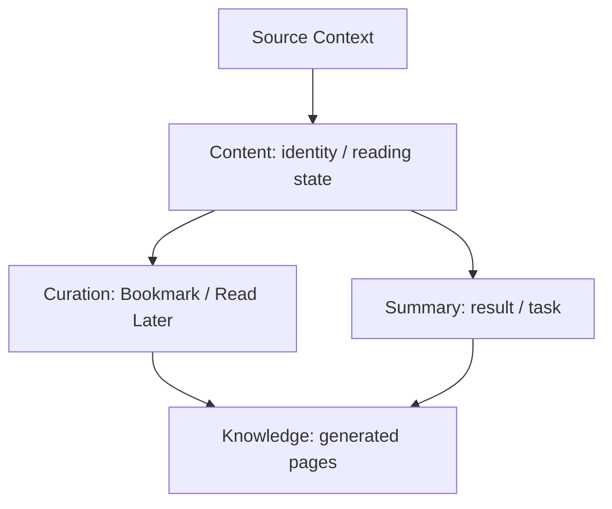

# 取り込みから整理・生成まで

取り込み元の状態、記事 identity と既読、保存・整理、AI 生成結果は、それぞれの owner へ分ける。ユーザー仕様は [コンテンツ仕様](../../docs/spec/04-content.md)、境界の正本は [Context Map](../../docs/architecture/context-map.md)。

## source から Content へ

RSS / Reddit / YouTube 等の source Context は固有の購読・fetch state を持つ。Content は共通 identity / metadata / reading state を所有する。[ContentSourceGateway](../../feature/article/domain/src/main/kotlin/dev/terashima/yomitorirss/feature/article/ContentSourceGateway.kt) は source が Content persistence を操作する Content-owned command port であり、source snapshot と content item を受け取る。実装は [Data adapter](../../feature/article/data/src/main/kotlin/dev/terashima/yomitorirss/feature/article/data/ContentSourceGateway.kt)、確認は [gateway test](../../feature/article/data/src/test/kotlin/dev/terashima/yomitorirss/feature/article/data/ContentSourceGatewayTest.kt)。

source が共通記事 table を直接所有するわけではない。購読の削除と Content の整理は公開 command の意味を確認して行う。

## Curation と生成結果

Curation は Bookmark、Tag、Folder、Read Later を所有する。Summary は要約と生成 task、Knowledge は生成 Wiki と source を扱う。Content / Curation を参照する際は owner API と named query を使い、foreign table の低レベル CRUD を新しい公開 capability にしない。

この図は意味上の流れであり、直接 SQL 参照を示していない。data flow は [System Overview](../../docs/architecture/system-overview.md)、テーブルの正本は [データ所有権](../architecture/persistence.md) を参照する。

## Bookmark から Web Library へ移す

[MoveBookmarkToLibraryUseCase](../../feature/bookmark/domain/src/main/kotlin/dev/terashima/yomitorirss/feature/bookmark/MoveBookmarkToLibraryUseCase.kt) は Bookmark-owned orchestration で、次の順に実行する。

1. Library の WebLibraryAdder で記事 URL と title hint から蔵書を追加する。
2. 成功後、BookmarkMutator で元の Bookmark を解除する。
3. Bookmark 変更の callback を呼ぶ。

Library 追加が失敗した場合は Bookmark 解除へ進まない。[UseCase test](../../feature/bookmark/domain/src/test/kotlin/dev/terashima/yomitorirss/feature/bookmark/MoveBookmarkToLibraryUseCaseTest.kt) は成功時の順序と追加失敗時に元の Bookmark が残ることを確認する。これは二つの owner port の順序を守る操作であり、両 Context の table を直接 write する共通 Repository ではない。

## 変更時に辿る先

- 取り込み・source identity: ContentSourceGateway の contract と adapter test。
- 保存・あとで読む・整理: Curation の capability と spec。
- 要約・Knowledge の非同期生成: [AI と background](ai-background.md)。
- Library / SMB / Podcast: [媒体連携](../integrations/media.md)。
- 新しい owner / shared concept: [System Overview](../architecture/system.md)、関連 ADR、Change Impact Review。
